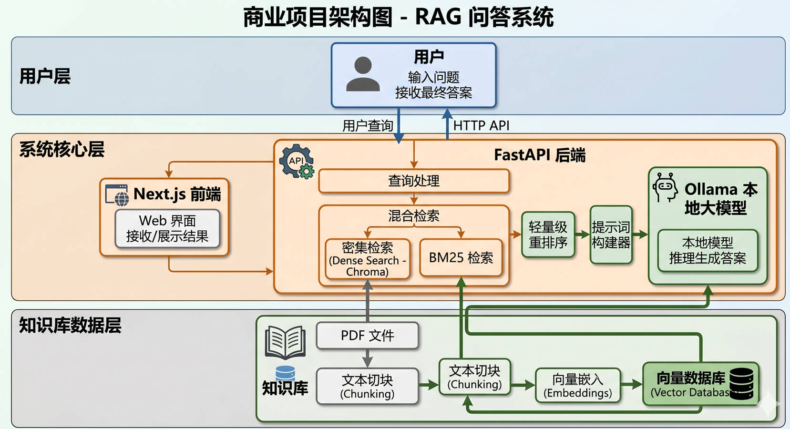

# Enterprise RAG Assistant

A full-stack enterprise knowledge base QA system built with Next.js + FastAPI + Local LLM.

一个基于 Next.js + FastAPI + 本地大模型的企业知识库问答系统，支持文档检索、混合搜索、来源追踪与前后端分离部署。

---

## Demo Screenshot



# Preview

- Ask questions in natural language
- Retrieve relevant enterprise documents
- Generate grounded answers with source references
- Full-stack architecture (Frontend + Backend)

---

# Tech Stack

## Frontend
- Next.js
- TypeScript
- Tailwind CSS

## Backend
- FastAPI
- Python

## AI / Retrieval
- Ollama
- Qwen2.5:1.5B
- ChromaDB
- Dense Retrieval
- BM25
- Jieba Tokenizer
- Lightweight Reranker

---

# Features

- PDF document ingestion
- Text chunking
- Embedding-based semantic search
- BM25 keyword retrieval
- Hybrid Retrieval (Dense + Sparse)
- Lightweight reranking
- Source citation tracing
- REST API service
- Frontend chat interface

---

# Project Structure

```text
enterprise-rag/
├── backend/
│   ├── app/
│   ├── data/
│   └── requirements.txt
├── frontend/
│   ├── src/
│   └── package.json
└── README.md
```

---

# API Example

## POST /ask

Request:

```json
{
  "question": "What is Bank Conflict?"
}
```

Response:

```json
{
  "success": true,
  "question": "What is Bank Conflict?",
  "answer": "...",
  "sources": [...]
}
```

---

# How to Run

## Backend

```bash
cd backend
uvicorn app.main:app --reload
```

## Frontend

```bash
cd frontend
npm install
npm run dev
```

---

# Roadmap

- [x] Full-stack MVP
- [ ] File upload & knowledge base management
- [ ] Multi-turn conversation memory
- [ ] Cloud deployment
- [ ] Dify / Coze integration

---

# Author

Lucas Huang